<div align="center">

# 🏗️ Achahib Lab

**A production-grade home lab simulating enterprise-level networking, security, virtualization, and cloud infrastructure.**

[](.)
[](.)
[](.)
[](.)
[](.)
[](.)

</div>

---

## 👤 About

Hi, I'm **Hamza** — an IT Engineer based in Morocco with **5+ years of experience** in networking, system administration, and cybersecurity. This repository is the central documentation hub for **Achahib Lab** — a fully self-hosted, enterprise-simulated environment covering network security, identity management, SIEM, vulnerability management, hybrid cloud, and infrastructure automation.

> *"Built to learn by doing — every component here mirrors a real enterprise deployment scenario."*

---

## 🗺️ Lab Architecture

<div align="center">



</div>

> **Legend:** Solid lines = physical connections · Orange dashed = Cloudflare Zero Trust tunnel · Blue dashed = Azure AD hybrid sync

---

## 📋 VLAN Table

| VLAN ID | Name | Purpose | Status |
|---|---|---|---|
| **1** | MGMT (Default) | All servers, management interfaces, infrastructure | ✅ Active |
| **11** | WIFI | Wireless clients | ✅ Active |
| **20** | LABs | Lab environments and testing machines | ✅ Active |
| **44** | VOIP | Voice over IP devices and PBX | ✅ Active |
| **50** | DMZ | Exposed services, public-facing servers | ✅ Active |
| **98** | INT-LABs | Internal isolated lab networks | ✅ Active |
| **100** | HOME | Home devices and personal endpoints | ✅ Active |
| **101** | Test | Temporary testing and sandboxing | ✅ Active |

---

## 📂 Repository Structure

```
achahib-lab/
├── 📁 network/
│   ├── opnsense/             # OPNsense + Zenarmor configs (sanitized)
│   ├── cisco-router/         # Inter-VLAN routing, ACLs, QoS
│   ├── cisco-switch/         # VLAN trunking, 802.1X port configs
│   ├── cisco-ise/            # ISE policies, RADIUS, NAC profiles
│   └── diagrams/             # Network topology diagrams
├── 📁 vlans/
│   ├── vlan-table.md         # Full VLAN documentation
│   └── acl-policies/         # Inter-VLAN ACL rules
├── 📁 vpn/
│   ├── wireguard/            # WireGuard OPNsense client config
│   ├── openvpn/              # OpenVPN server setup & auth
│   └── double-tunnel/        # WireGuard → OpenVPN architecture docs
├── 📁 zero-trust/
│   ├── cloudflare-warp/      # WARP client deployment & policies
│   ├── ztna-apps/            # Application access policies (on-prem)
│   └── gateway-dns/          # DoH policies, category filtering
├── 📁 security/
│   ├── wazuh/                # SIEM rules, agents, dashboards
│   ├── openvas/              # Scan configs, reports, remediation
│   └── zenarmor/             # IDS/IPS policies, SNI rules
├── 📁 virtualization/
│   ├── esxi/                 # VMware ESXi setup, VM inventory
│   └── hyper-v/              # Hyper-V configs, VM templates
├── 📁 servers/
│   ├── windows-server/       # AD, DNS, DHCP, GPO configurations
│   ├── azure/                # Hybrid AD, Azure AD Connect setup
│   ├── nextcloud/            # Nextcloud deployment, SSL, automation
│   └── zabbix/               # Monitoring templates, alert rules
├── 📁 automation/
│   ├── rudder/               # Rudder policies, Linux automation
│   └── scripts/              # Bash/Python utility scripts
├── 📁 backup/
│   └── urbackup/             # UrBackup server config, schedules
└── 📁 docs/
    ├── reports/              # PDF lab reports
    └── write-ups/            # Project write-ups & lessons learned
```

---

## 🧩 Lab Components

### 🔐 Network Security & Edge

| Component | Role | Key Features |
|---|---|---|
| **OPNsense** | Edge Firewall / Gateway | NAT, DoH gateway, VLAN routing, WireGuard client |
| **Zenarmor** | NGFW Plugin | IDS/IPS, SNI inspection, app-layer control, TLS inspection |
| **Cisco Router** | Distribution Layer | Inter-VLAN routing, ACLs, QoS, policy enforcement |
| **Cisco Switch** | Layer 2 Core | VLAN trunking, port segmentation, 802.1X enforcement |
| **Cisco ISE** | NAC / AAA | 802.1X auth, identity-based access, RADIUS |

---

### ☁️ Zero Trust & Cloud Access

| Component | Role | Key Features |
|---|---|---|
| **Cloudflare WARP** | Zero Trust Client | Encrypted tunnel to Cloudflare network from any device |
| **Cloudflare ZTNA** | App Access (Zero Trust) | Access on-prem applications without exposing them to internet |
| **Cloudflare Gateway** | DNS Security | DoH enforcement, category filtering, malware/phishing blocking |

> 💡 **How it works:** Users connect via **Cloudflare WARP** → traffic goes through **Cloudflare Zero Trust network** → tunneled back to **on-prem applications** via a secure connector — no public IP exposure, no traditional VPN.

---

### 🔒 VPN Architecture

| Component | Role | Key Features |
|---|---|---|
| **WireGuard (OPNsense)** | Outbound VPN Client | Tunnels traffic from OPNsense to VPS gateway |
| **VPS (WG Server)** | VPN Gateway | Acts as the WireGuard server and OpenVPN relay |
| **OpenVPN** | Remote Access VPN | Full traffic redirection through WireGuard tunnel |

> 💡 **Double Tunnel:** `Client → OpenVPN → WireGuard → VPS → Internet` — OpenVPN traffic is wrapped inside WireGuard for layered encryption and fingerprint obfuscation.

---

### 📊 Monitoring & SIEM

| Component | Role | Key Features |
|---|---|---|
| **Wazuh** | SIEM / EDR | Log ingestion, intrusion detection, FIM, compliance |
| **Zabbix** | Infrastructure Monitoring | Real-time metrics, dashboards, alerting |
| **OpenVAS** | Vulnerability Scanner | Network-wide scans, CVE analysis, remediation |

---

### 🖥️ Virtualization & Servers

| Component | Role | Key Features |
|---|---|---|
| **VMware ESXi** | Primary Hypervisor | Bare-metal virtualization, HA, VM management |
| **Hyper-V** | Secondary Hypervisor | Multi-system simulations, Windows-native VMs |
| **Windows Server (ADDC)** | Identity & Directory | Active Directory, DNS, DHCP, GPO |
| **Azure Cloud** | Hybrid Cloud | Azure AD Connect, hybrid identity integration |
| **Nextcloud** | Private Cloud Storage | Self-hosted file sharing, internal SSL, automation |

---

### ⚙️ Automation & Backup

| Component | Role | Key Features |
|---|---|---|
| **Rudder** | Config Management | Linux automation, compliance policies, drift detection |
| **UrBackup** | Backup Solution | Image + file backups, incremental, centralized |

---

## 🚀 Key Projects

### ✅ Completed

- **[DNS over HTTPS Gateway]** — OPNsense + Cloudflare Gateway enforcing network-wide DoH with category-based DNS filtering
- **[Zero Trust Remote Access]** — Cloudflare WARP + ZTNA replacing traditional VPN — on-prem apps accessible without port forwarding
- **[Double VPN Architecture]** — WireGuard tunnel (OPNsense → VPS) wrapping OpenVPN for layered encryption
- **[802.1X NAC with Cisco ISE]** — Identity-based access control with RADIUS across all switch ports
- **[VLAN Segmentation]** — 8 VLANs with full inter-VLAN ACL policy enforcement
- **[Hybrid AD (On-prem → Azure)]** — Azure AD Connect syncing on-premises AD to Azure AD
- **[Centralized SIEM with Wazuh]** — Log collection from all components with custom detection rules
- **[Infrastructure Monitoring]** — Zabbix dashboards covering all network and server components

### 🔨 In Progress

| Project | Description |
|---|---|
| `HMIND SecOps Platform` | AI-powered SOC automation with incident response workflows |
| `Jarvis AI Assistant` | Self-hosted AI assistant with tool-calling capabilities |
| `OpenVAS Automation` | Scheduled scans + auto-reporting pipeline |
| `Rudder Full Coverage` | Full Linux fleet automation with compliance policies |

---

## 🎓 Certifications

| Certification | Status |
|---|---|
| CCNA | ✅ Completed |
| CCNP Security — SCOR 350-701 | ✅ Completed |
| Microsoft AZ-900 | ✅ Completed |
| NDG Linux / Intro to Cybersecurity | ✅ Completed |
| PCCSE (Prisma Cloud) | 🔄 In Progress |
| AZ-700 (Azure Security Engineer) | 🔄 In Progress |

---

## ⚠️ Security Notice

All configurations published here are **sanitized**:
- ❌ No private keys (WireGuard, SSL/TLS)
- ❌ No credentials, tokens, or API keys
- ❌ No real public IPs or internal addressing
- ✅ All sensitive values replaced with safe placeholders

---

## 📬 Connect

- 💼 [LinkedIn](www.linkedin.com/in/hamza-a-8117b51a8)
- 🐙 [GitHub](https://github.com/hamzachi)

---

<div align="center">

*Every component in this lab was deployed, broken, debugged, and redeployed — that's how real learning happens.*

</div>
