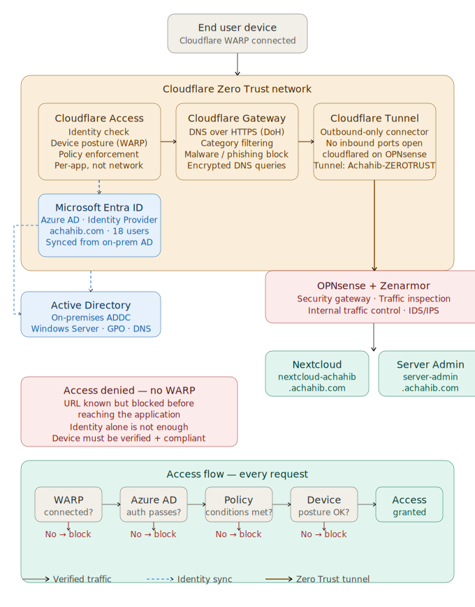

# Cloudflare Zero Trust — Home Lab Implementation

> **Stack:** OPNsense · Cloudflare Tunnel · Cloudflare WARP · Cloudflare Access · Microsoft Entra ID (Azure AD)  
> **Status:** ✅ Production — Running in Achahib Lab  
> **Domain:** `achahib.com`

---

## 🎯 Objective

Replace traditional VPN-based remote access with a modern **Zero Trust architecture** — where no user or device is trusted by default, even if it is inside the network.

Every access request is verified based on:
- **Identity** — who are you? (Azure AD)
- **Device** — is your device compliant? (WARP + device posture)
- **Context** — do you meet the access policy? (Cloudflare Access)

> *Never trust, always verify.*

---

## ❌ The Problem with Traditional VPN

| VPN | Zero Trust |
|---|---|
| Grants broad network access | Grants access only to specific apps |
| Once connected → user is "inside" | Identity + device verified every request |
| Large attack surface | No exposed services, no open ports |
| Network-based trust | Identity-based trust |

Traditional VPN connects users to a **network**. Zero Trust connects users to **specific applications** — nothing more.

---

## 🏗️ Architecture

<div align="center">



</div>

> **Legend:** Solid lines = verified traffic · Blue dashed = identity sync · Orange = Zero Trust tunnel

**Key principle:** OPNsense establishes an **outbound-only** Cloudflare Tunnel. No inbound firewall ports are opened. Users cannot reach the services directly — they go through Cloudflare's identity layer first.

---

## 🔧 Components

### 1. Cloudflare Tunnel — `Achahib-ZEROTRUST`

The tunnel connects my home lab to Cloudflare's network **without opening any inbound ports** on OPNsense or the ISP router.

- **Connector type:** cloudflared (running on OPNsense)
- **Status:** Healthy — 17h+ uptime
- **Function:** All published app routes go through this tunnel

OPNsense acts as the security gateway — inspecting and filtering traffic before it reaches any internal service.

---

### 2. Published Application Routes

Internal applications are mapped to public subdomains through the tunnel:

| Route | Internal Service | Exposed? |
|---|---|---|
| `nextcloud-achahib.achahib.com` | Nextcloud instance | ❌ Not directly |
| `server-admin.achahib.com` | Admin portal | ❌ Not directly |

Each URL is accessible **only after passing Zero Trust policies** — not by network location.

> **Routing vs Access Control:**
> - Published Application Routes = *where* traffic goes (routing)
> - Applications = *who* can access it (identity + policy)

---

### 3. Cloudflare Access — Applications

Two self-hosted applications are protected by Zero Trust policies:

| Application | URL | Type |
|---|---|---|
| Nextcloud-achahib | `nextcloud-achahib.achahib.com` | Self-hosted |
| Server-Admin | `server-admin.achahib.com` | Self-hosted |

---

### 4. Access Policies

Two reusable policies control who can access each application:

| Policy | Action | Applied to |
|---|---|---|
| `Allow-With-WARP` | ALLOW | Requires WARP connected + identity match |
| `Zero Trust org` | ALLOW | Org-level identity verification |

Access is granted **only when all conditions are met simultaneously** — identity + device posture + policy.

---

### 5. Microsoft Entra ID (Azure AD) — Identity Provider

- **Tenant:** `achahib.com`
- **Users:** 18 | **Groups:** 13 | **Devices:** 12
- **Sync:** On-premises Active Directory → Azure AD (via AD Connect)

Users are managed locally in AD and validated in the cloud for Zero Trust authentication. Cloudflare Access uses Azure AD as the Identity Provider (IdP) — users must authenticate via Azure AD before accessing any protected application.

---

### 6. Cloudflare WARP — Device Agent

WARP is the client-side component installed on end-user devices. When connected:

- All DNS queries go through Cloudflare Gateway (encrypted DoH)
- Device posture is checked and reported
- The device is registered and linked to a user identity
- Traffic to internal apps is routed through Zero Trust network

**Device posture data collected:**
- OS version, Model, MAC address
- User ID linkage
- Last session timestamp

The device is trusted **only after verification** — not by network location.

---

### 7. Access Flow — What Actually Happens

```
User opens nextcloud-achahib.achahib.com
         │
         ▼
Cloudflare Access intercepts the request
         │
         ▼
Is WARP connected?  ──No──► ❌ ACCESS DENIED (Forbidden)
         │
        Yes
         ▼
Authenticate via Azure AD (Sign in with Microsoft)
         │
         ▼
Does identity match policy?  ──No──► ❌ ACCESS DENIED
         │
        Yes
         ▼
Does device meet posture requirements?  ──No──► ❌ ACCESS DENIED
         │
        Yes
         ▼
✅ Traffic forwarded through Cloudflare Tunnel → OPNsense → Nextcloud
```

---

### 8. Access Denied — Proof It Works

When a device without WARP connected tries to access `nextcloud-achahib.achahib.com`:

> **Result:** Cloudflare Access blocks the request with `403 Forbidden` before it ever reaches the internal network.

This proves that:
- The URL alone is **not enough**
- Identity alone is **not enough**
- **Both** device posture AND identity must pass

---

## 🔐 Security Posture

| Layer | Control | Status |
|---|---|---|
| Network | No inbound ports on OPNsense | ✅ |
| Tunnel | Outbound-only Cloudflare Tunnel | ✅ |
| DNS | Gateway DoH filtering | ✅ |
| Identity | Azure AD authentication | ✅ |
| Device | WARP device posture check | ✅ |
| Policy | Per-application access rules | ✅ |
| Inspection | OPNsense + Zenarmor on internal traffic | ✅ |

---

## 📝 Lessons Learned

- **Cloudflare Tunnel eliminates port forwarding entirely** — no attack surface on the WAN side
- **Device posture is critical** — identity alone can be compromised; device state adds a second factor
- **Azure AD as IdP** integrates seamlessly with Cloudflare Access — hybrid AD (on-prem + cloud) works well for this setup
- **OPNsense + Cloudflare Tunnel** is a powerful combination — OPNsense handles internal security while Cloudflare handles external access control
- **Per-app access > network access** — if one app is compromised, lateral movement is impossible because users never have network-level access

---

## 🔗 Related

- [Lab Architecture Overview](/README.md)
- [OPNsense Configuration](../network/opnsense/)
- [Azure Hybrid AD Setup](../servers/azure/)
